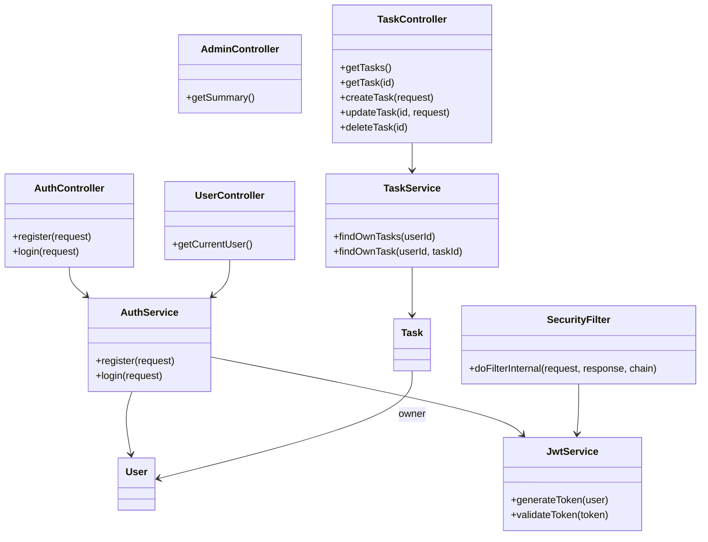

# Diagrama de clases

```mermaid
classDiagram
    class AuthController {
        +register(request)
        +login(request)
    }

    class UserController {
        +getCurrentUser()
    }

    class AdminController {
        +getSummary()
    }

    class TaskController {
        +getTasks()
        +getTask(id)
        +createTask(request)
        +updateTask(id, request)
        +deleteTask(id)
    }

    class AuthService {
        +register(request)
        +login(request)
    }

    class JwtService {
        +generateToken(user)
        +validateToken(token)
    }

    class SecurityFilter {
        +doFilterInternal(request, response, chain)
    }

    class TaskService {
        +findOwnTasks(userId)
        +findOwnTask(userId, taskId)
    }

    class User
    class Task

    AuthController --> AuthService
    AuthService --> JwtService
    SecurityFilter --> JwtService
    UserController --> AuthService
    TaskController --> TaskService
    TaskService --> Task
    AuthService --> User
    Task --> User : owner

```
