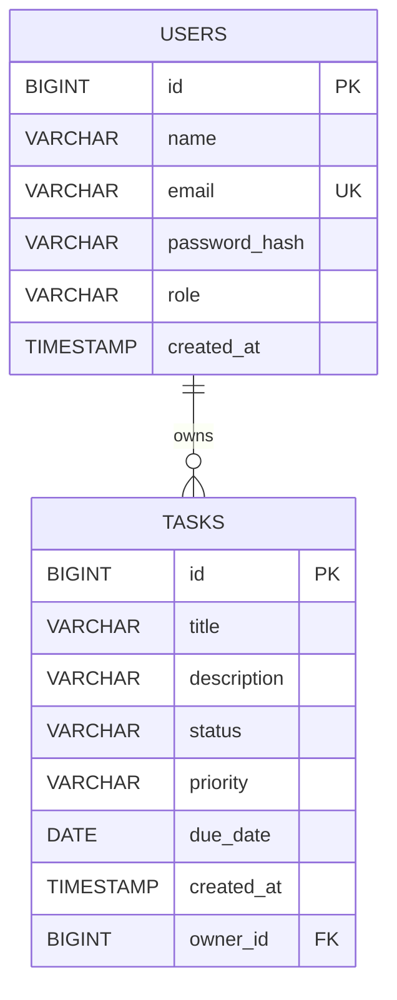

# Modelo entidad-relación

```mermaid
erDiagram
    USERS ||--o{ TASKS : owns

    USERS {
        BIGINT id PK
        VARCHAR name
        VARCHAR email UK
        VARCHAR password_hash
        VARCHAR role
        TIMESTAMP created_at
    }

    TASKS {
        BIGINT id PK
        VARCHAR title
        VARCHAR description
        VARCHAR status
        VARCHAR priority
        DATE due_date
        TIMESTAMP created_at
        BIGINT owner_id FK
    }

```
